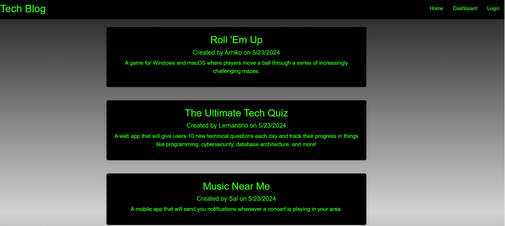

# Tech Blog
  ## Description
  

  This application is a CMS-style blog site where developers can publish their blog posts and comment on other developers’ posts. It uses Handlebars.js as the templating language, Sequelize as the ORM, and the express-session npm package for authentication. 

  Users can sign up, login, and logout. All current posts are displayed on homepage. Clicking on any post displays just that post with any comments that have been left, and allows user to leave a comment. After logging in, user can go to dashboard to view their posts, create a new post, or edit/delete an existing post.

  Live site deployed to Render at:  https://tech-blog-p0i5.onrender.com

  ## Table of Contents

  * [Installation](#installation)
  * [Usage](#usage)
  * [Credits](#credits)
  * [License](#license)
  * [Contributing](#contributing)
  * [Tests](#tests)
  * [Questions](#questions)

  ## Installation

N/A

  ## Usage

Click login to sign up. Once logged in, click any post from homepage to add comment. Click on dashboard to create new post. On posts in dashboard, click edit or delete buttons to edit or delete that post.

  ## Credits

  I would like to thank my classmates, TAs, and tutors in the UCF Bootcamp for their advice and access to resources. 

  ## License

  
  This project is licensed under the MIT License.

  [License: MIT](https://opensource.org/licenses/MIT)

  ## Contributing

  If you would like to make any contributions, please make any changes in a branch and submit a pull request with detailed comments.

  ## Tests

  See Usage 

  ## Questions

  For more information, see my [GitHub](https://github.com/42Salokin)

  Send any questions or comments to nicholas.dpoul@gmail.com
